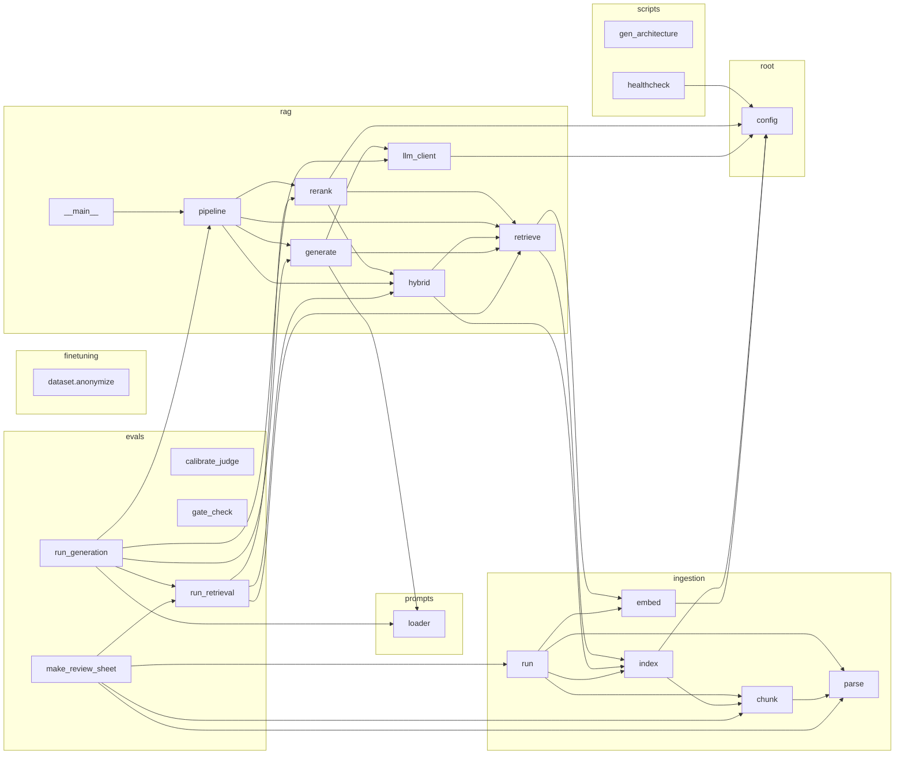

# Architecture

> Auto-generated by `scripts/gen_architecture.py` (pre-commit hook). Do NOT edit by hand.
> Nodes = project modules, edges = imports (incl. lazy/deferred). GitHub renders this inline.

